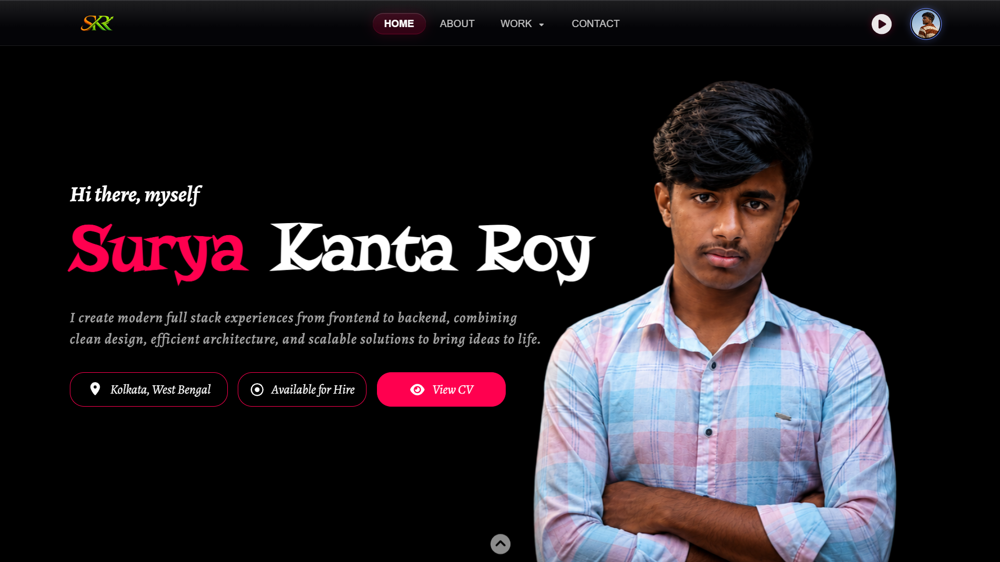

# 🌐 Surya Kanta Roy - Personal Portfolio

A modern, highly interactive, and visually stunning personal portfolio website built to showcase my skills, projects, and journey as a Full Stack Developer. Designed with attention to detail, smooth animations, and a premium aesthetic.

<p align="center">
  
</p>

## 🚀 Live Demo

*([suryakantaroy.vercel.app](https://suryakantaroy.vercel.app/))*

## ✨ Highlighted Features

- **🎬 Cinematic Multilingual Splash Screen:** A premium intro sequence that greets users in multiple languages before a smooth "curtain-raise" reveal of the homepage.
- **🎨 Modern Glassmorphism UI:** Sleek transparent elements, blurred backdrops, and glowing accents.
- **🕒 Interactive Hero Buttons:** Location tags that transform into a live local clock on hover/click, along with an "Available for Hire" status indicator and a quick "View CV" button.
- **🖼️ Swipeable 3D Card Gallery:** An interactive, draggable image gallery in the "About" section to showcase personal interests (Culture, Photography, Sports).
- **📱 Fully Responsive Design:** Meticulously crafted to look perfect on both desktop and mobile devices.
- **🌙 Deep Dark Theme:** A visually comfortable dark background `#080808` accented with vibrant `#ff004f` highlights.
- **🛠 Services Section:** Highlighting backend, frontend, and design capabilities.
- **💼 Comprehensive Projects Showcase:** Dedicated pages and links for featured projects (MealHub, FitTrack, MedBill, etc.).
- **📬 Functional Contact Form:** Fully integrated with Google Sheets API to receive messages directly.
- **🖼 Smooth Scrolling & Scroll Indicators:** Enhances navigation and user flow.

## 🛠 Tech Stack

**Frontend Architecture:**
- **HTML5:** Semantic and accessible structure.
- **CSS3:** Advanced flexbox/grid layouts, keyframe animations, clip-paths, media queries, and CSS variables.
- **JavaScript (Vanilla):** DOM manipulation, time-fetching logic, touch/wheel events for the gallery, and sequence orchestration for the intro.

**Libraries, Fonts & External Tools:**
- **Google Fonts:** Lora, Alegreya, La Belle Aurore, Poppins.
- **FontAwesome:** Scalable vector icons.
- **Google Apps Script / Sheets API:** For handling contact form submissions seamlessly without a dedicated backend.

## 📂 Project Structure

```text
Portfolio/
│
├── html/                   # Sub-pages and project details
│   ├── works.html          # Dedicated portfolio/works grid
│   ├── project-livecodex.html
│   ├── project-ctm.html
│   ├── project-fittrack.html
│   ├── project-mealhub.html
│   ├── project-medbill.html
│   ├── project-portfolio.html
│   └── project-PaletteLab.html
│
├── js/                     # Modular JavaScript files
│   ├── main.js             # Global logic (Mobile menu, Splash intro)
│   ├── home.js             # Home page logic (Carousels, Tabs, Effects)
│   └── project.js          # Project-specific logic (Scroll tracking)
│
├── images/                 # Optimized images and CV PDF
├── Video/                  # Video assets for Showreel
│
├── mesh-text.js            # External mesh text animation library
├── index.html              # Main homepage & core layout (Root)
├── style.css               # Global stylesheet and animations
└── README.md               # Project documentation
```

## 💼 Featured Projects

### 🍽 MealHub
A smart mess management platform that simplifies meal tracking, expenses, and budget management.

### 🏋️ FitTrack
A fitness tracking application for monitoring workouts and healthy lifestyle activities.

### 📊 CTM
An all-in-one project management solution featuring task organization, team collaboration, progress monitoring, calender view for deadline reminder and real-time workflow management.

### 💻 LivecodeX
A real-time collaborative code editor with integrated video calling and chat, built with React, Clerk, and Stream.

### 🎨 PaletteLab
A modern web-based color palette generation and analysis tool that helps designers extract beautiful color palettes from images with precision.


## 📬 Contact Information

**Surya Kanta Roy**
- 📍 **Location:** Kolkata, West Bengal
- 📧 **Email:** suryarahulroy321@gmail.com
- 🔗 **LinkedIn:** *[Surya Kanta Roy](https://www.linkedin.com/in/surya-kanta-roy-363866338/)*
- 🐙 **GitHub:** [S-K-Roy18](https://github.com/S-K-Roy18)

## ⚙️ Local Installation

Clone the repository to run it locally:

```bash
git clone https://github.com/S-K-Roy18/Portfolio.git
cd Portfolio
```

Simply open `index.html` in your favorite modern web browser to view the site! No build tools or package managers required.

---
⭐ *If you found this project inspiring or helpful, consider giving it a star on GitHub! And dont't do clone or copy without my permission...*
